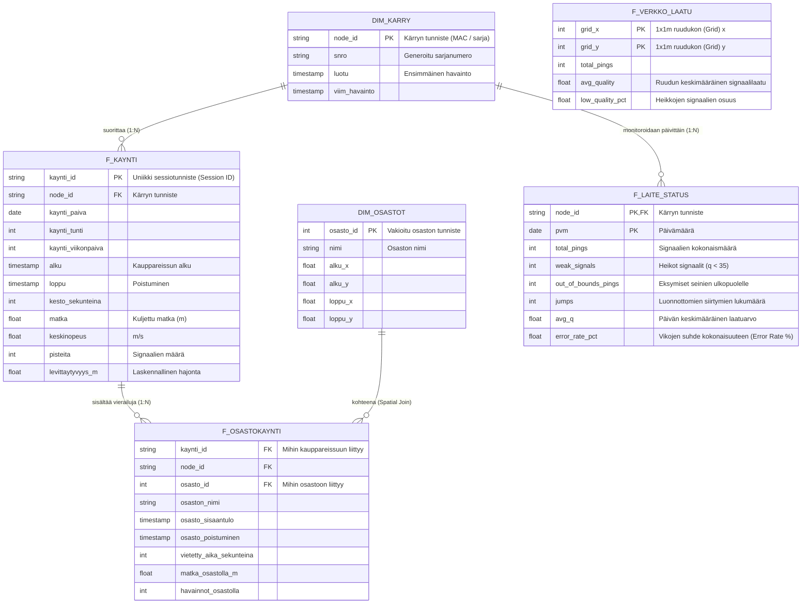

# Tietokantojen riippuvuudet (ER-kaavio)

Alla on kuvattu valmiin tuotantotasoisen **Gold-kerroksen** arkkitehtuuri, eli ne taulut, jotka analytiikkaputki rakentaa analysoitavaksi ja tuotantoon. 

Arkkitehtuuri on jaettu kahteen loogiseen tähtimalli-tyyppiseen (Star Schema) kokonaisuuteen: myymäläanalytiikkaan sekä laitteiston diagnostiikkaan.

### Taulujen kuvaus

**Perustiedot (Dimensions / Master Data):**
* **DIM_KARRY**: Laajennettu perustietotaulu laitteille (ostoskärryille). Sisältää elinkaaritiedot teknistä valvontaa varten.
* **DIM_OSASTOT**: Staattisesta esiladatusta tiedostosta (Seed) rakennettu taulu, joka määrittää kaupan fyysiset rajat ja osastojen alueet sijaintikyselyitä varten.

**Myymäläanalytiikka (Fact Tables):**
* **F_KAYNTI**: Järeä tapahtumataulu (Fact), jokainen rivi edustaa yhtä aitoa kauppareissua. Kertoo reissun avainluvut (KPI), aikaleimat ja viikonpäiväyhteenvedot.
* **F_OSASTOKAYNTI**: Yksityiskohtainen taulu jokaisen kauppareissun sisäisistä etapeista (rakentuu sijaintipohjaisella risteyslogiikalla eli Spatial Joinilla). Tämän avulla saadaan raporttinäkymällä (Dashboard) avattua yhden asiakkaan kauppareissu ja tutkittua minuutti minuutilta pysähdykset ja viipymät eri osastoilla.

**Laiteanalytiikka (IoT Diagnostics):**
* **F_LAITE_STATUS**: Kytkeytyy suoraan kärryihin. Päivätason luotettavuusyhteenveto jokaiselle laitteelle; varoittaa teknistä tutkijaa rikkoutuvista akuista tai hajoavista sensoreista, näyttämällä puhtaita virheprosentteja (Error Rate) päiväkohtaisesti.
* **F_VERKKO_LAATU**: Sijaintiin kiinteästi sidottu, yksittäisistä kärryistä irrallinen signaalien kuumuuskartta (Heatmap). Jakaa kaupan lattiapinta-alan yhden neliömetrin kokoisiin resoluutioruutuihin (Grid) ja laskee absoluuttisen signaalinlaadun tälle fyysiselle alueelle, jotta verkon asentajat voivat tarkistaa kyseisen sijainnin mahdolliset fyysiset esteet (esim. suuret metallihyllyt tai kylmälaitteet).
