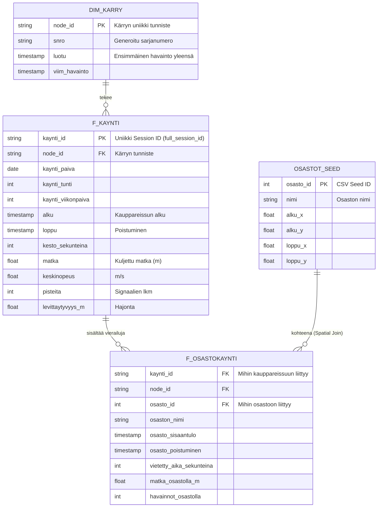

# Entity-Relationship (ER) -kaavio

Alla on kuvattu valmiin tuotantotasoisen **Gold-kerroksen** arkkitehtuuri, eli ne taulut, jotka dbt rakentaa BI-työkaluille analysoitavaksi ja tuotantoon. 

Nyt kun meillä on myös tuo `osasto.csv` mukana rakennelmassa, tietokannan relationaalinen malli näyttää loistavalta Star Schema -tyyppiseltä rakenteelta!

### Taulujen kuvaus
* **DIM_KARRY**: Dimensiotaulu laitteille (ostoskärryille).
* **OSASTOT_SEED**: Staattinen dbt Seed -taulu, jota ylläpidetään CSV-tiedostosta. Määrittää fyysiset kaupan alueet.
* **F_KAYNTI**: Järeä faktataulu. Kertoo koko kauppareissun KPI:t, aikaleimat ja yhteenvedot. Tämä on paras taulu viikonpäiväanalyyseille!
* **F_OSASTOKAYNTI**: Yksityiskohtainen faktataulu (rakentamani Spatial Join -kaavan pohjalta). Tämän avulla saadaan dashboardilla klikattua auki yksi kauppareissu ja tutkittua minuutilleen "Missä tämä asiakas vietti ne 45 minuuttia".
