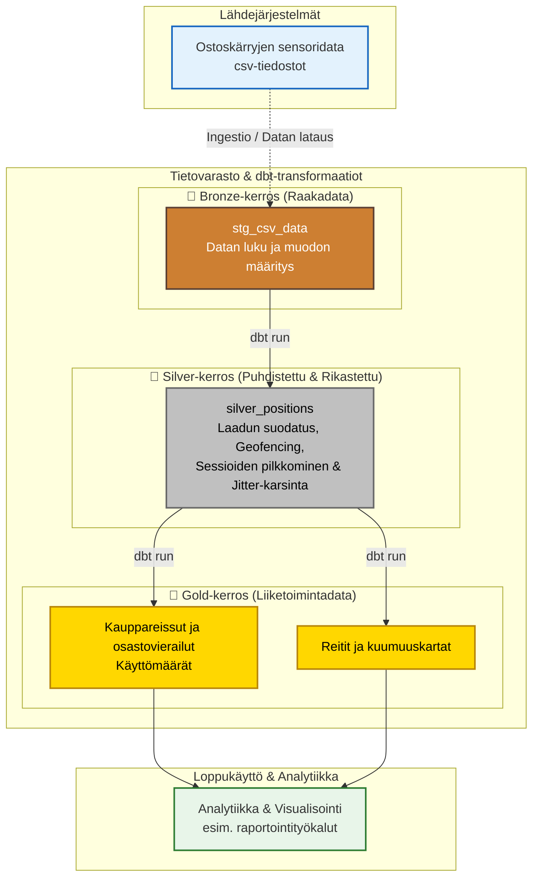

# ByteBuddies - Ylätason Arkkitehtuuri

Alla on kuvattu projektin ylätason data-arkkitehtuuri, joka noudattaa Medallion-rakennetta (Bronze, Silver, Gold). Tämä kaavio havainnollistaa, miten ostoskärryjen raaka sensoridata muuttuu analytiikassa ja raporteissa käytettäväksi liiketoimintatiedoksi.

## Arkkitehtuurin vaiheet:
1. **Lähdejärjestelmät:** Ostoskärryt tuottavat reaaliaikaista (viiveellä siirrettävää) lokaatiodataa CSV-muodossa. Z-koordinaatti on rajattu heti alussa pois keveyden vuoksi.
2. **Bronze (Raakadata):** `stg_csv_data` -malli ottaa datan vastaan muuttumattomana. Tässä vaiheessa tiedot validoidaan teknisesti (tietotyypit).
3. **Silver (Puhdistettu & Rikastettu):** `silver_positions` -malli putsaa epäilyttävät datapisteet pois `q`-arvon avulla ja laskee nopeuden (m/s) sekä etäisyydet. Tässä kerroksessa toteutetaan ankarat tuotantotason siivoussäännöt: Geofencing (rajojen ja lataustelakoiden poisto), aukioloaikojen suodatus, sekä pitkien signaalitaukojen (yli 15 min) pilkkominen eri asioinneiksi uuden `session_id`:n avulla.
4. **Gold (Liiketoimintadata):** Viedään data tasolle, jossa se vastaa suoraan liiketoiminnan kysymyksiin: kuinka pitkiä kauppareissut ovat ja millä alueilla karttaa vietetään eniten aikaa. Tässä vaiheessa validoidaan koko reissut (poistetaan esim. liian lyhyet alle 3 minuutin, tai matkallisesti (alle 30m) olemattomat "haamuasioinnit" kokonaan analytiikasta).
5. **Loppukäyttö:** Helposti hyödynnettävä ja skaalautuva muoto, johon analyytikot tai BI-työkalut voivat yhdistää suoraan.
