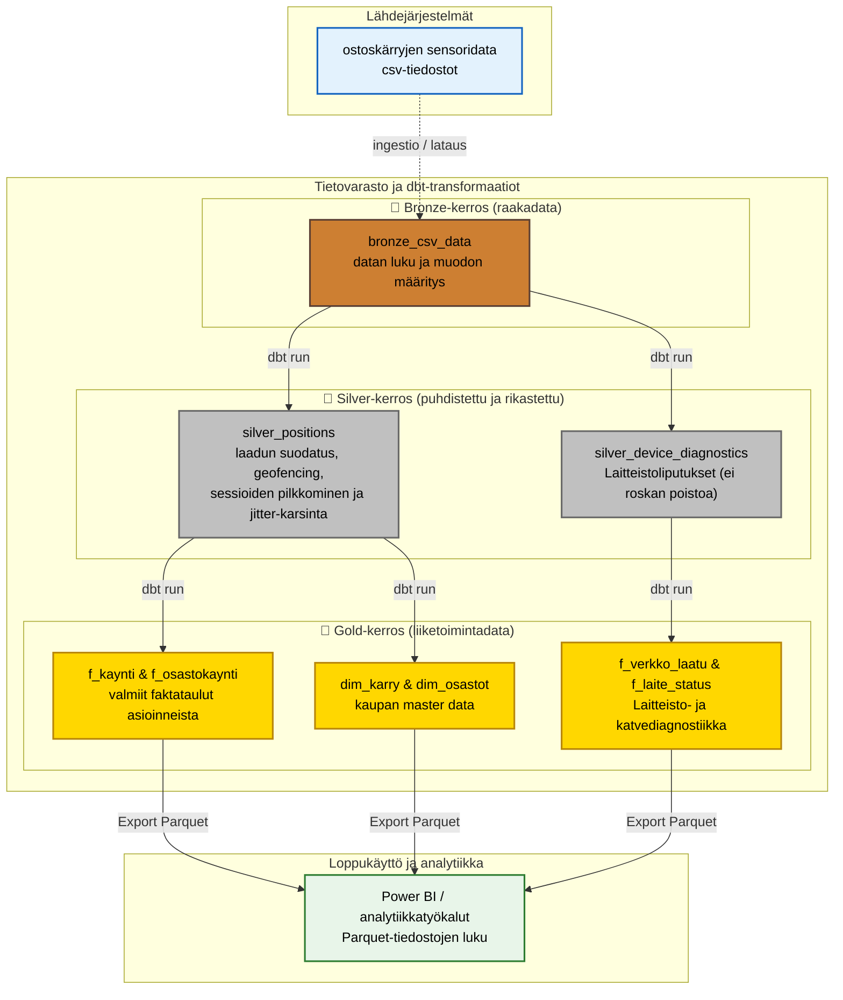

# ByteBuddies - Ylätason arkkitehtuuri

Alla on kuvattu projektin ylätason data-arkkitehtuuri, joka noudattaa Medallion-rakennetta (bronze, silver, gold). Tämä kaavio havainnollistaa, miten ostoskärryjen raaka sensoridata muuttuu analytiikassa ja raporteissa käytettäväksi liiketoimintatiedoksi.

## Arkkitehtuurin vaiheet:
1. **Lähdejärjestelmät:** Ostoskärryt tuottavat reaaliaikaista (viiveellä siirrettävää) lokaatiodataa csv-muodossa. Z-koordinaatti on rajattu heti alussa pois keveyden vuoksi.
2. **Bronze (raakadata):** `bronze_csv_data` -malli ottaa datan vastaan muuttumattomana. Tässä vaiheessa tiedot validoidaan teknisesti (tietotyypit).
3. **Silver (puhdistettu ja rikastettu):** Datan prosessointi haarautuu kahteen erilliseen putkeen:
   - **Kaupan alan analytiikka:** `silver_positions` putsaa datapisteet tiukasti rajojen mukaisesti (esim. q > 35) ja poistaa ulkopuoliset kävelyt. Tämä jättää jälkeensä vain kliinistä aitoa ostosdataa.
   - **IoT-laitevalvonta:** `silver_device_diagnostics` säilyttää kaiken roskadatan nimenomaan virheiden profilointia varten: se tunnistaa ja liputtaa katvealueet (q<35) ja siirtymän jitterit asettamatta poistosuodatusta.
4. **Gold (liiketoimintadata):** Viedään data tasolle, jossa se vastaa suoraan liiketoiminnan kysymyksiin: 
   - **Myymäläanalytiikka:** `f_kaynti`, `f_osastokaynti`, `dim_osastot` muodostavat tähtimallin myymälän läpäisyn ja tuottojen analysointiin.
   - **Laitteistoanalytiikka:** `f_verkko_laatu` ja `f_laite_status` luovat 1x1m tarkkuuden kuumuuskarttoja katvealueista sekä päivätason laitekohtaisia virheprosentteja (esim. signaalien laatu ja hypyt).
5. **Loppukäyttö:** Tietokantataulut viedään dbt-ajojen päätteeksi automaattisesti fyysisiksi, nopeiksi ja sarakepohjaisiksi `.parquet` -tiedostoiksi (External Materialization). Tämän ansiosta analyytikot tai BI-työkalut (esim. Power BI) voivat lukea dataa täydellä teholla vapaasti (Data Contract) aiheuttamatta alkuperäisen duckdb-tietokannan lukittumista (Zero-locking architecture).
