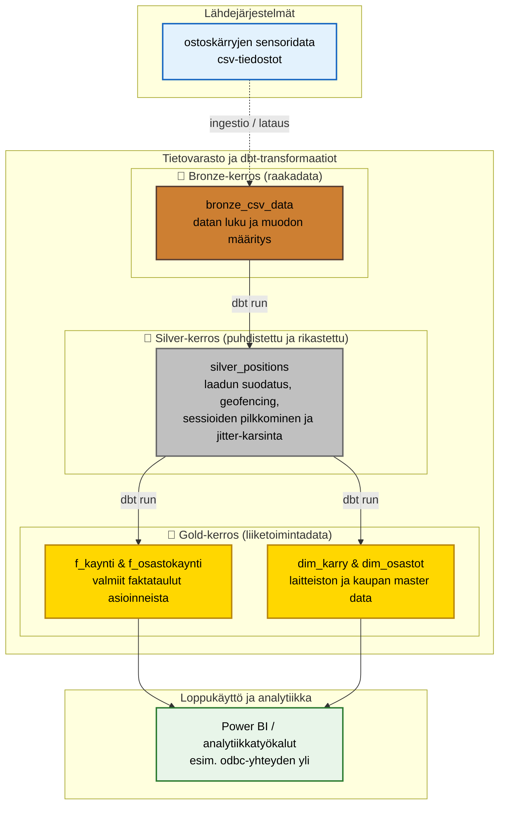

# ByteBuddies - Ylätason arkkitehtuuri

Alla on kuvattu projektin ylätason data-arkkitehtuuri, joka noudattaa Medallion-rakennetta (bronze, silver, gold). Tämä kaavio havainnollistaa, miten ostoskärryjen raaka sensoridata muuttuu analytiikassa ja raporteissa käytettäväksi liiketoimintatiedoksi.

## Arkkitehtuurin vaiheet:
1. **Lähdejärjestelmät:** Ostoskärryt tuottavat reaaliaikaista (viiveellä siirrettävää) lokaatiodataa csv-muodossa. Z-koordinaatti on rajattu heti alussa pois keveyden vuoksi.
2. **Bronze (raakadata):** `bronze_csv_data` -malli ottaa datan vastaan muuttumattomana. Tässä vaiheessa tiedot validoidaan teknisesti (tietotyypit).
3. **Silver (puhdistettu ja rikastettu):** `silver_positions` -malli putsaa epäilyttävät datapisteet pois schemassa määriteltyjen rajojen mukaisesti (esim. q > 35) ja laskee nopeuden (m/s) sekä etäisyydet esilaskentana. Tässä kerroksessa toteutetaan ankarat tuotantotason siivoussäännöt: geofencing (rajojen ja lataustelakoiden poisto), aukioloaikojen suodatus, sekä pitkien signaalitaukojen (yli 15 min) pilkkominen eri asioinneiksi uuden `session_id`:n avulla.
4. **Gold (liiketoimintadata):** Viedään data tasolle, jossa se vastaa suoraan liiketoiminnan kysymyksiin: kuinka pitkiä kauppareissut ovat ja millä alueilla karttaa vietetään eniten aikaa. Sisältää valmiit faktataulut (`f_kaynti`, `f_osastokaynti`) sekä dimensiotaulut (`dim_osastot`, `dim_karry`), muodostaen yhdessä helppokäyttöisen tähtimallin (star schema).
5. **Loppukäyttö:** Helposti hyödynnettävä ja skaalautuva muoto, johon analyytikot tai BI-työkalut (esim. Power BI) voivat yhdistää suoraan, välttäen raskaiden kyselyiden pyörittämistä lennosta.
