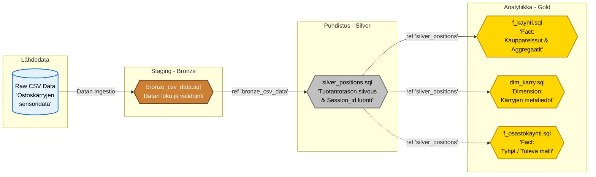

# Datan Sukupuu (Data Lineage)

Tämä kaavio esittää tarkasti dbt-projektimme datamallien riippuvuudet toisistaan. Se on datainsinöörin vastine arkkitehtuurikuvalle – se ei kerro _mitä järjestelmiä käytämme_, vaan _miten data virtaa tiedostosta toiseen_ ja mitä `ref()` -viittauksia mallit käyttävät.

### Lineagen Merkitys
Tästä dbt:n sisäisestä hierarkiasta näkee selkeästi, miksi teimme nuo äskeiset korjaukset:
1. Jos `silver_positions` -logiikka (esim. geofence) muuttuu, se valuu **suoraan alas** kaikkiin Gold-tason malleihin (Fakta- ja Dimensiotaulut perivät valmiiksi puhtaan datan).
2. Tuleva osastovierailujen malli (`f_osastokaynti`) on helppo vääntää, koska voimme viitata siinä ainoastaan puhtaaseen Silver-kantaan, jolloin yksikään osastovierailu ei voi syntyä haamudatan, öisten aukioloaikojen ohi tai seinien sisältä!
