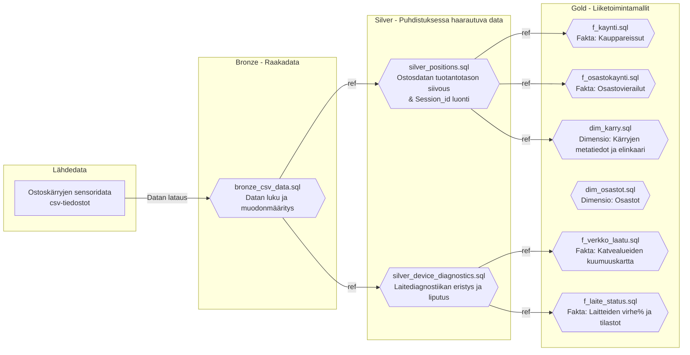

# Datan Sukupuu (Linjasto)

Tämä kaavio esittää tarkasti dbt-projektimme datamallien riippuvuudet toisistaan. Se on datainsinöörin vastine arkkitehtuurikuvalle – se ei kerro _mitä järjestelmiä käytämme_, vaan _miten data virtaa tiedostosta toiseen_ ja mitä `ref()` -viittauksia mallit käyttävät.

### Linjaston (Lineage) Merkitys
Tästä dbt:n sisäisestä hierarkiasta näkee selkeästi suomalaisen data-arkkitehtuurimme ydinajatuksen:
1. **Laadunhallinnan eriyttäminen:** Koska `silver_positions` -logiikka ja `silver_device_diagnostics` -logiikka haarautuvat heti raakadatan (Bronze) jälkeen ylöspäin, pysyy myymälän ostosvirta täysin puhtaana kohinasta ja roskadatasta (katvealueet), mutta samalla IoT-laitevalvonta kykenee tutkimaan täydellisesti viottuneita verkko-ongelmia rikkomatta liiketoiminnan lukuja!
2. **Keskitetty logiikka (Single Source of Truth):** Jos esimerkiksi myymälän seiniin tehdään laajennus (x/y rajojen muutos), kynnysarvo muutetaan ainoastaan Silver-tason koodiin. Kaikki ylemmät myymälän Gold-tason mallit perivät puhtaan uuden todellisuuden täysin automaattisesti ilman että raportteja tarvitsee muokata.
