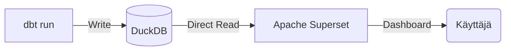

# Apache Superset: Asennus ja Konfigurointi (DuckDB)

Tämä opas ohjeistaa, kuinka asennat **Apache Supersetin** paikalliseen Windows-ympäristöön ja yhdistät sen projektin **DuckDB**-tietovarastoon. Superset korvaa aiemman Power BI -ratkaisun ja lukee dataa suoraan DuckDB:stä ilman välikerroksia.

---

## 🛠️ 1. Esivaatimukset

Ennen asennusta varmista, että tietokoneellasi on:
1. **Visual Studio Build Tools**: [Lataa tästä](https://visualstudio.microsoft.com/downloads/). Valitse asennuksessa "C++ build tools" (tämä on välttämätön joidenkin Python-kirjastojen kääntämiseen).
2. **Python 3.11**: Superset toimii parhaiten tällä versiolla.

---

## 🚀 2. Asennusvaiheet

Aja seuraavat komennot terminaalissa (esim. PowerShell tai Git Bash):

### Virtuaaliympäristön luonti ja aktivointi
```bash
# Luodaan oma ympäristö Supersetille
py -3.11 -m venv venv311

# Aktivointi (Windows PowerShell / CMD)
.\venv311\Scripts\activate
```

### Kirjastojen asennus
```bash
# Päivitetään asennustyökalut
python -m pip install --upgrade pip setuptools wheel

# Asennetaan itse Superset
pip install apache-superset
```

---

## ⚙️ 3. Konfigurointi (SECRET_KEY)

Superset vaatii salaisen avaimen toimiakseen turvallisesti. 

> [!IMPORTANT]
> **Windows-käyttäjät**: Jos käytät Git Bashia, voit käyttää `.bashrc`-tiedostoa. Jos käytät PowerShelliä tai haluat pysyvän ratkaisun, on suositeltavaa käyttää `superset_config.py`-tiedostoa.

### Vaihe A: Ympäristömuuttujat (Git Bash)
Avaa `~/.bashrc` (esim. `nano ~/.bashrc`) ja lisää:
```bash
export SUPERSET_SECRET_KEY="super-salainen-avain-123456789"
export FLASK_APP=superset
```

### Vaihe B: Pysyvä asetus (superset_config.py)
Luo tiedosto `superset_config.py` superset-kansioon ja varmista, että se sisältää:
```python
SECRET_KEY = 'super-salainen-avain-123456789'

# Esimerkki ominaisuuslipuista
FEATURE_FLAGS = {
    "DASHBOARD_CROSS_FILTERS": True,
}
```
Aseta sitten ympäristömuuttuja osoittamaan tähän tiedostoon (Git Bash):
`export SUPERSET_CONFIG_PATH=/c/Users/tuija/code/2026/superset/superset_config.py`

---

## 🏁 4. Alustus ja käynnistys

Suorita seuraavat komennot peräkkäin:

```bash
# Päivitetään tietokantarakenne
superset db upgrade

# Luodaan järjestelmänvalvoja (Admin)
superset fab create-admin

# Alustetaan Superset (roolit ja oikeudet)
superset init

# Asennetaan DuckDB-ajuri
pip install duckdb-engine

# Käynnistetään palvelin porttiin 8088
superset run -p 8088 --with-threads --reload
```

---

## 📊 5. Tietokantayhteyden muodostaminen

Kun Superset pyörii, mene osoitteeseen [http://localhost:8088](http://localhost:8088).

1. Kirjaudu sisään luomillasi Admin-tunnuksilla.
2. Navigoi: **Settings** > **Data: Databases**.
3. Paina **+ Database**.
4. Valitse listasta **DuckDB**.
5. Syötä **SQLAlchemy URI**:
   `duckdb:///C:/Users/tuija/code/2026/bytebuddies/data/warehouse/dev.duckdb`
6. Paina **Connect** ja **Finish**.

> [!TIP]
> **Pro Tip**: DuckDB lukee dataa suoraan levyltä. Jos saat lukitusvirheitä (locking error), varmista ettei dbt-ajo ole käynnissä samanaikaisesti. DuckDB sallii useat lukijat, mutta vain yhden kirjoittajan kerrallaan.

---


